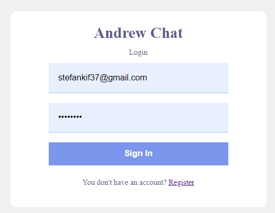
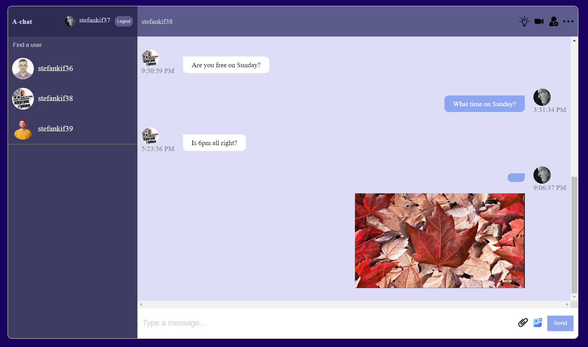
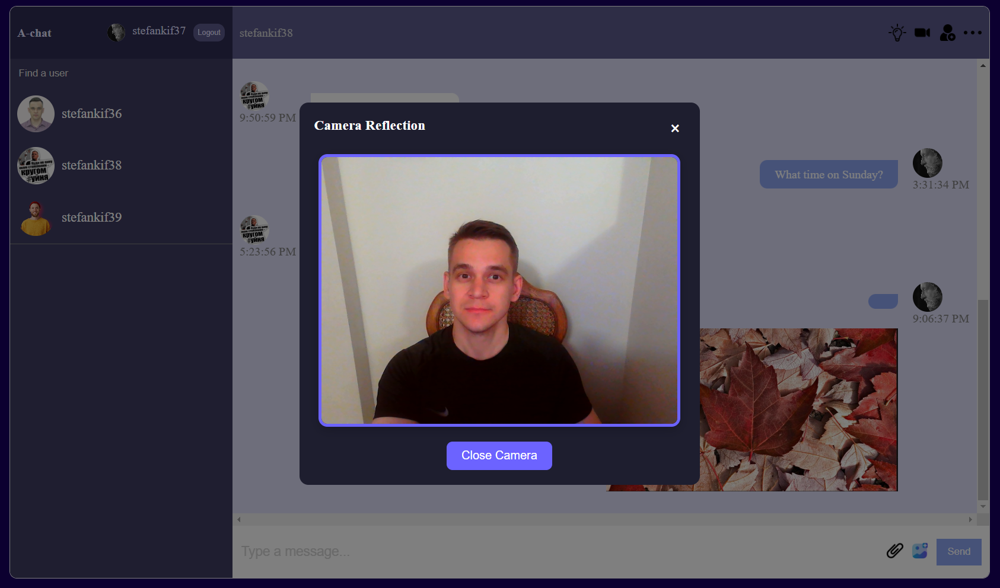

# Andrew-chat

This React.js project is built with **google-firebase**

### Steps:
- Go to [the website](https://andrew-chatt.netlify.app/).

- Proceed to the [/register page](https://andrew-chatt.netlify.app/register) to sign up.

- Log in [/login](https://andrew-chatt.netlify.app/login) into your account.

- Send messages and share photos with your friends.

### Login

### Chat

### Camera
Only turns the camera on
